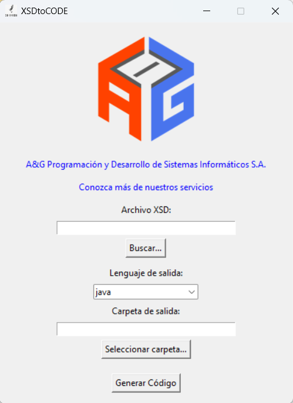

# XSDtoCODE


**XSDtoCODE** es una herramienta escrita en **Python**, diseñada para automatizar la generación de clases a partir de archivos **XSD** (XML Schema Definition). Su propósito principal es simplificar la integración de esquemas XML en proyectos de software modernos, permitiendo que los desarrolladores trabajen directamente con **objetos y clases de programación** en lugar de manipular XML manualmente. Esto asegura que las clases generadas reflejen con precisión el esquema definido y pueden **serializarse y deserializarse automáticamente a XML**, eliminando errores y esfuerzo manual.

La herramienta es compatible con múltiples lenguajes de programación, incluyendo **Java**, **C#**, **Python**, **PHP** y **JSONSchema**, lo que la hace ideal para entornos heterogéneos y proyectos que requieren consistencia entre sistemas que usan distintos lenguajes. Al soportar varios lenguajes, XSDtoCODE permite:

- Generar **modelos de datos robustos y confiables** directamente desde el esquema XSD.  
- Reducir errores humanos asociados con la creación manual de XML o clases.  
- Mantener sincronización automática entre el esquema XML y las clases utilizadas en la aplicación.  
- Acelerar el desarrollo de aplicaciones que consumen o producen datos XML, incluyendo **factura electrónica** y sistemas financieros.

Para cada lenguaje, XSDtoCODE utiliza generadores especializados:  

- **Java**: [`xjc`](https://docs.oracle.com/javase/8/docs/technotes/tools/unix/xjc.html), que convierte esquemas XSD en clases Java listas para serializar/deserializar XML.  
- **C#**: [`XmlSchemaClassGenerator`](https://github.com/mganss/XmlSchemaClassGenerator), que crea clases .NET compatibles con el esquema XML.  
- **Python**: [`xsdata`](https://github.com/tefra/xsdata), que genera clases Python modernas con soporte completo para serialización y deserialización automática de XML.  
- **PHP**: `xsd2php.phar` (compilado desde [goetas-webservices/xsd2php](https://github.com/goetas-webservices/xsd2php)) ejecutado con PHP portable para generar clases PHP y metadata compatibles con JMS Serializer.  
- **JSONSchema**: [`xsd2jsonschema`](https://github.com/tiirwaa/XSDtoCODE/blob/main/node/convert_xsd_to_jsonschema.js), que transforma XSD en esquemas JSON, permitiendo interoperabilidad con aplicaciones que usan JSON basado en XML.

Entre los principales beneficios de usar XSDtoCODE se incluyen:  

- **Automatización completa**: Genera automáticamente clases y mapeos, evitando la codificación manual de XML y estructuras de datos.  
- **Compatibilidad**: El generador de clases funciona actualmente en **Windows**, pero los modelos generados son estándar y pueden compilarse y ejecutarse en cualquier plataforma compatible con el lenguaje correspondiente.  
- **Integración con sistemas existentes**: Permite generar clases listas para integrarse con **servicios web SOAP**, **REST APIs basadas en XML**, APIs internas o intercambios de datos empresariales.  
- **Flexibilidad**: Posibilidad de personalizar nombres de clases, paquetes o namespaces según las necesidades del proyecto.  
- **Reducción de errores**: Al trabajar con clases generadas automáticamente, se minimizan las inconsistencias y errores que surgen al escribir XML a mano.  
- **Ahorro de tiempo en mantenimiento**: Cada cambio en el XSD puede reflejarse regenerando las clases, manteniendo la aplicación sincronizada con el esquema actualizado.

XSDtoCODE es ideal para desarrolladores y equipos que trabajan con:  

- **Servicios web basados en XML** (SOAP o REST XML)  
- **Facturación electrónica y sistemas financieros** que requieren intercambio de datos XML confiable  
- **Intercambio de información empresarial** (EDI, XML estándar)  
- **Sistemas que necesitan serialización y deserialización confiable de XML**  
- **Proyectos que requieren interoperabilidad entre múltiples lenguajes y plataformas**

En resumen, **XSDtoCODE** transforma archivos XSD en clases de programación listas para usar, que se pueden **serializar y deserializar automáticamente como XML**, facilitando la integración de datos XML en cualquier proyecto y garantizando **consistencia, eficiencia y robustez** en el desarrollo de software.


---



---

## 📦 Dependencias

### UI: `tkinter`

```bash
pip install tkinter
```

Instala las siguientes dependencias con `pip`:

```bash
pip install pillow
pip install xsdata
pip install "xsdata[cli]"
```

## 🔣 Lenguajes disponibles actualmente

- Java
- C#
- Python
- PHP
- JSONSchema

---

## 🖥️ Uso en Consola

```bash
python main.py "archivo.xsd" "java|python|csharp|php|JSONSchema" "carpeta_salida"
```

```bash
main.exe "archivo.xsd" "java|python|csharp|php|JSONSchema" "carpeta_salida"
```

## ⚙️ Generar EXE
```bash
generar_exe.bat
```

## PHP Portable

XSDtoCODE incluye **PHP completamente portable** (versión 8.3.27), por lo que **no requiere instalación previa de PHP** en el sistema anfitrión. El ejecutable final incorpora:

- PHP 8.3.27 Thread Safe para Windows x64
- Todas las extensiones estándar necesarias
- El `xsd2php.phar` compilado desde goetas-webservices/xsd2php
- Configuración mínima de `php.ini`

Durante la build en GitHub Actions se compila automáticamente el `.phar` con Composer y Box, y se empaqueta dentro de `dist/XSDtoCODE/_internal/`. Así evitamos versionar archivos gigantes y siempre se distribuye la versión actualizada del generador PHP. Esto garantiza que la generación de clases PHP funcione en cualquier sistema Windows sin dependencias externas adicionales.


##  
Desarrollado por: [A&G Programación y Desarrollo de Sistemas Informáticos S.A.](https://agsoft.co.cr)  

